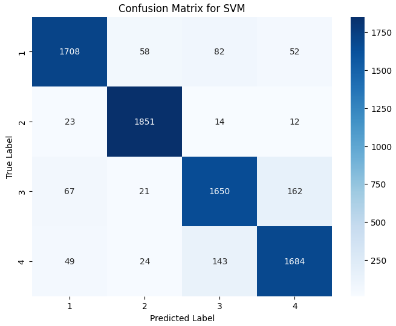
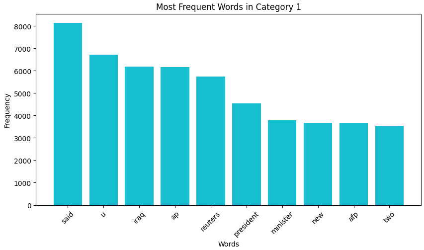
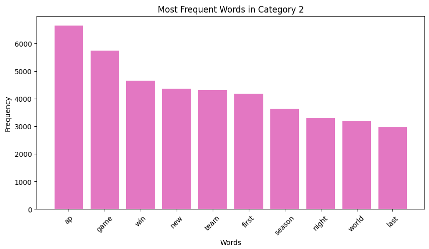
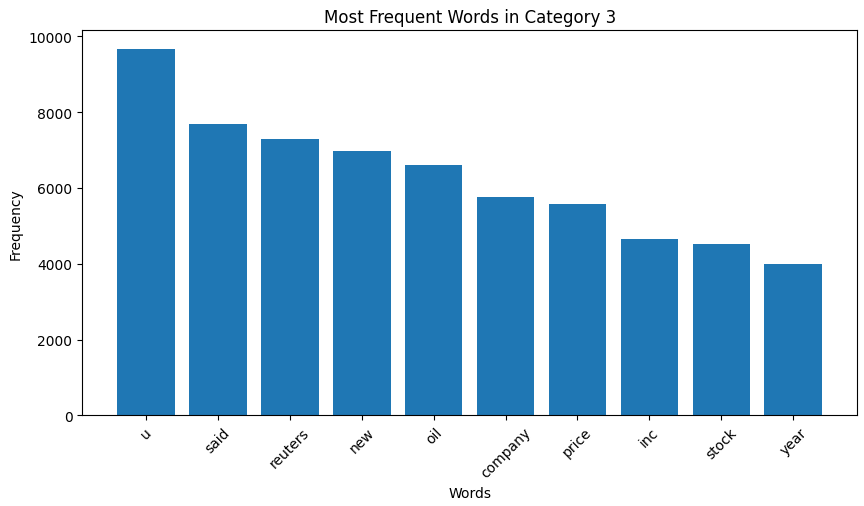
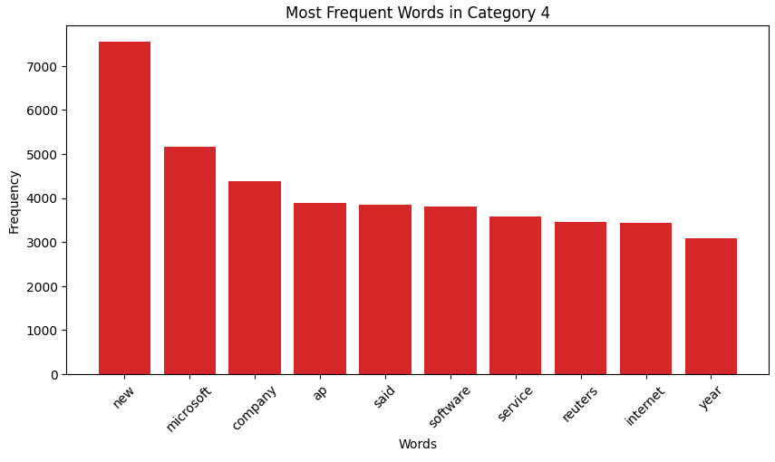

# 📰 News Category Classification

This project is a **Multiclass Text Classification** task using Machine Learning and Deep Learning to classify news articles into four categories.

---

## 🚀 Project Overview

- **Goal**: Classify news headlines and descriptions into one of 4 categories
- **Dataset**: AG News (train/test split)
- **Approach**: Preprocess text → Vectorize using TF-IDF → Train ML models + Neural Network → Evaluate & visualize results
- **Techniques Used**: Object-Oriented Programming (OOP), TF-IDF, Logistic Regression, Random Forest, SVM, Neural Networks (Keras)

---

## 📁 Dataset

The dataset used is the [AG News Classification Dataset](https://www.kaggle.com/datasets/amananandrai/ag-news-classification-dataset).

Since the files exceed GitHub's size limit, you can download them from:
🔗 **Google Drive**:  
[AG News Dataset + Colab Notebook](https://drive.google.com/drive/folders/1IL4DevN7d0cR-GCQRiwLrYiHtPP9RlFy?usp=drive_link)

Or directly from:
🔗 **Kaggle**:  
[AG News Dataset on Kaggle](https://www.kaggle.com/datasets/amananandrai/ag-news-classification-dataset)

---

## 🧠 What I Did

- Combined `Title` and `Description` for better context
- Cleaned and preprocessed text (lowercase, punctuation removal, lemmatization, stopword removal)
- Converted text to numeric features using **TF-IDF**
- Trained multiple classifiers:
  - `Logistic Regression`
  - `Random Forest`
  - `SVM (Linear Kernel)`
  - `Feedforward Neural Network (Keras)`
- Evaluated models using Accuracy, F1-score, and Confusion Matrix
- Visualized most frequent words per category
- Built modular pipeline using **OOP**

---

## 📊 Visualizations

### 🔢 Confusion Matrices

- `Logistic Regression`  
  

- `Random Forest`  
  

- `SVM`  
  

### 🧾 Most Frequent Words by Category

- `Category 1`  
  

- `Category 2`  
  

- `Category 3`  
  

- `Category 4`  
  

---

---

## 🤖 Bonus: Neural Network Classifier

```python
# In addition to traditional ML models, a simple feedforward Neural Network was implemented using Keras.

# ✅ Preprocessing:
# - Text data was transformed using TF-IDF.
# - Labels were converted to One-Hot Encoding.
# - Sparse TF-IDF matrix was converted to dense array.

# 🧠 Model Architecture:
Sequential([
    Input(shape=(input_dim,)),
    Dense(128, activation='relu'),
    Dense(64, activation='relu'),
    Dense(num_classes, activation='softmax')
])

# ⚙️ Compilation:
model.compile(loss='categorical_crossentropy', optimizer='adam', metrics=['accuracy'])

# 🏋️ Training:
model.fit(X_train, y_train, epochs=10, batch_size=32)

# ✅ Evaluation Result:
# Neural Network Accuracy: 0.90

# 📋 Classification Report:
#               precision    recall  f1-score   support
#            0       0.91      0.90      0.90      1900
#            1       0.96      0.96      0.96      1900
#            2       0.87      0.86      0.87      1900
#            3       0.87      0.88      0.87      1900
#
#     accuracy                           0.90      7600
#    macro avg       0.90      0.90      0.90      7600
# weighted avg       0.90      0.90      0.90      7600
```


## 🗂️ Project Structure

```bash
.
├── ag_news_classification.ipynb    # Main notebook
├── /images                         # Folder with visualizations
│   ├── Logistic Regression.png
│   ├── Random Forest.png
│   ├── SVM.png
│   ├── Category_1.png
│   ├── Category_2.png
│   ├── Category_3.png
│   ├── Category_4.png
├── README.md                       # Project documentation
```

---

## ⚙️ How to Run

1. Install required libraries:
```bash
pip install pandas scikit-learn nltk keras matplotlib seaborn
```

2. Download the dataset from the **Google Drive** or **Kaggle** links above

3. Run the notebook:
```bash
jupyter notebook ag_news_classification.ipynb
```

Or use **Google Colab** and mount your Drive.

---

## ✍️ Author

**Mostafa Abbas Saleh**  
AI Student | NLP Practitioner

---

## 🙏 Acknowledgment

Thanks to **Elevvo** for the valuable internship experience and training.
